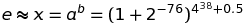

# GMP, MPFR, FLINT (&amp; ARB) for Windows

## Introduction

GMP, MPFR, FLINT and ARB are well known numerical libraries for large integer and arbitrary precision floating point arithmetic. A special emphasis is given to _ball arithmetic_ library [ARB](https://github.com/fredrik-johansson/arb/) by Frederik Johansson.

**_Arb is merged with Flint 3.0.0 and is not available as a separate library since._**

The repository doesn't contribute to the functionality, but is a guide for building 32-bit & 64-bit static and shared libraries for Windows.

## System and environment

- Windows 11 64-bit
- MSYS2 with **base-devel**, **mingw-w64-i686-gcc**, **mingw-w64-x86_64-gcc**, **yasm**, **m4**, **make**, **autotools**
- versions used for current builds:
   - GMP v6.3.0 ([https://gmplib.org/](https://gmplib.org/))
   - MPFR v4.2.1 ([http://www.mpfr.org/mpfr-current/](http://www.mpfr.org/mpfr-current/))
   - FLINT v3.0.0-alpha1 ([http://flintlib.org/downloads.html](http://flintlib.org/downloads.html))
   - with FLINT hosting ARB v2.23.0 ([https://github.com/fredrik-johansson/arb/](https://github.com/fredrik-johansson/arb/))
- **_build_ARB.sh_**

Cygwin isn't used as it does not handle symbolic links used by some **configure** and **make** scripts in a desirable way, and is generaly not intended to be used as Windows build environment. MSYS2 solves the issues by implementing customized **ln** command which simply creates hard-copies and is designed as a build environment.

## Workflow

1. Install MSYS2, update it, and install **base-devel**, **mingw-w64-i686-gcc**, **mingw-w64-x86_64-gcc**, **yasm**
2. Extract GMP, MPFR & FLINT src into MSYS2 **_/opt/src_** folder.
3. Check and adapt `SOURCE` variable in **_build_ARB.sh_**, i.e. `SOURCE=/opt/src`.
4. Finally, after starting MSYS2 **mingw32.exe** shell for 32-bit or **mingw64.exe** shell for 64-bit build, execute the following command and the build process will start:
```
$ build_ARB.sh
```
**_build_ARB.sh_** automatically executes the entire workflow with timing & log files written to MSYS2 **_/var/log_** folder.

## Deliverables

Once built, **_i686_** or **_x86_64_** folder will be created in MSYS2 **_/opt_** folder based on the compiler bitness ($arch).

**_/opt/$arch/bin_** contains shared libraries (**_libgmp-10.dll_**, **_libgmpxx-4.dll_**, **_libmpfr-6.dll_**, **_libflint.dll_**).
**_/opt/$arch/include_** contains header files needed to build against the libraries.
**_/opt/$arch/lib_** contains static libraries for compiler and target defined in **_build_ARB.sh_**.
**_/opt/$arch/shared_** contains some documentation automatically generated during build process.

## Demo

In this demo we evaluate one simple _pandigital approximation_ of natural constant **e** correct to 46 decimal places. ARB also calculates accumulated numerical error so every result is printed as _ball_ containing the result with absolute certainty. Internal computational precision is set to `p=1000`, way more than needed. Both static and dynamic lib versions are presented.



### Static
```
#include <stdlib.h>

#include "arb.h"


int main()
{
	long p = 1000;
	long d = 53;
	arb_t a, b, x, t;
	
	printf("Computed with Arb %s\n", arb_version);

	arb_init(a);
	arb_init(b);
	arb_init(x);
	arb_init(t);

	// a = 1 + 2 ^ -76
	arb_set_str(a, "2", p);
	arb_set_str(t, "-76", p);
	arb_pow(a, a, t, p);
	arb_set_str(t, "1", p);
	arb_add(a, t, a, p);
	printf("a   = "); arb_printd(a, d); printf("\n");

	// b = 4 ^ 38 + 0.5
	arb_set_str(b, "0.5", p);
	arb_ui_pow_ui(t, 4, 38, p);
	arb_add(b, t, b, p);
	printf("b   = "); arb_printd(b, d); printf("\n");

	// x = a ^ b
	arb_pow(x, a, b, p);
	printf("x   = "); arb_printd(x, d); printf("\n");
	arb_const_e(t, p);
	printf("e   = "); arb_printd(t, d); printf("\n");
	arb_sub(t, x, t, p);
	printf("x-e = "); arb_printd(t, d); printf("\n");

	arb_clear(a);
	arb_clear(b);
	arb_clear(x);
	arb_clear(t);

	return EXIT_SUCCESS;
}
```
32-bit demo is compiled using **build_arb_demo_32.sh** or via the following command line in MSYS2 mingw32 environment.
```
$ gcc -Ibuild/i686/include -Ibuild/i686/include/flint arb_demo.c -obuild/i686/bin/static_demo.exe -Lbuild/i686/lib -lflint -lmpfr -lgmp
```
```
$ ./build/i686/bin/static_demo.exe
Computed with 32-bit Arb 2.23.0
a   = 1.0000000000000000000000132348898008484427979425390731 +/- 0
b   = 75557863725914323419136.500000000000000000000000000000 +/- 0
x   = 2.7182818284590452353602874713526624977572470937396380 +/- 1.1407e-300
e   = 2.7182818284590452353602874713526624977572470936999596 +/- 3.7331e-301
x-e = 3.9678376581476207465438603498757884997818078351607135e-47 +/- 1.5140e-300
```

### Shared (dynamic) for Windows

```
#include <windows.h>

#include "arb.h"


int main()
{
	HINSTANCE hArb = LoadLibrary(TEXT("libflint.dll"));

	if (! hArb) {
		printf("Error loading libflint.dll\n");
		printf("Error code: %ld\n", GetLastError());
		printf("https://docs.microsoft.com/en-us/windows/win32/debug/system-error-codes\n");

		return EXIT_FAILURE;
	}

	char* arb_version_d = *( (char**) GetProcAddress(hArb, "arb_version"));
	printf("Computed with Arb %s\n", arb_version_d);

	typedef void(__cdecl *arb_add_t)      (arb_t, arb_t, arb_t, long);
	typedef void(__cdecl *arb_clear_t)    (arb_t);
	typedef void(__cdecl *arb_const_e_t)  (arb_t, long);
	typedef void(__cdecl *arb_init_t)     (arb_t);
	typedef void(__cdecl *arb_pow_t)      (arb_t, arb_t, arb_t, long);
	typedef void(__cdecl *arb_printd_t)   (arb_t, long);
	typedef void(__cdecl *arb_set_str_t)  (arb_t, const char*, long);
	typedef void(__cdecl *arb_sub_t)      (arb_t, arb_t, arb_t, long);
	typedef void(__cdecl *arb_ui_pow_ui_t)(arb_t, long, long, long);

	arb_add_t       arb_add_d       = (arb_add_t)      GetProcAddress(hArb, "arb_add");
	arb_clear_t     arb_clear_d     = (arb_clear_t)    GetProcAddress(hArb, "arb_clear");
	arb_const_e_t   arb_const_e_d   = (arb_const_e_t)  GetProcAddress(hArb, "arb_const_e");
	arb_init_t      arb_init_d      = (arb_init_t)     GetProcAddress(hArb, "arb_init");
	arb_pow_t       arb_pow_d       = (arb_pow_t)      GetProcAddress(hArb, "arb_pow");
	arb_printd_t    arb_printd_d    = (arb_printd_t)   GetProcAddress(hArb, "arb_printd");
	arb_set_str_t   arb_set_str_d   = (arb_set_str_t)  GetProcAddress(hArb, "arb_set_str");
	arb_sub_t       arb_sub_d       = (arb_sub_t)      GetProcAddress(hArb, "arb_sub");
	arb_ui_pow_ui_t arb_ui_pow_ui_d = (arb_ui_pow_ui_t)GetProcAddress(hArb, "arb_ui_pow_ui");

	long p = 1000;
	long d = 53;
	arb_t a, b, x, t;
	
	arb_init_d(a);
	arb_init_d(b);
	arb_init_d(x);
	arb_init_d(t);

	// a = 1 + 2 ^ -76
	arb_set_str_d(a, "2", p);
	arb_set_str_d(t, "-76", p);
	arb_pow_d(a, a, t, p);
	arb_set_str_d(t, "1", p);
	arb_add_d(a, t, a, p);
	printf("a   = "); arb_printd_d(a, d); printf("\n");

	// b = 4 ^ 38 + 0.5
	arb_set_str_d(b, "0.5", p);
	arb_ui_pow_ui_d(t, 4, 38, p);
	arb_add_d(b, t, b, p);
	printf("b   = "); arb_printd_d(b, d); printf("\n");

	// x = a ^ b
	arb_pow_d(x, a, b, p);
	printf("x   = "); arb_printd_d(x, d); printf("\n");
	arb_const_e_d(t, p);
	printf("e   = "); arb_printd_d(t, d); printf("\n");
	arb_sub_d(t, x, t, p);
	printf("x-e = "); arb_printd_d(t, d); printf("\n");

	arb_clear_d(a);
	arb_clear_d(b);
	arb_clear_d(x);
	arb_clear_d(t);

	FreeLibrary(hArb);

	return EXIT_SUCCESS;
}
```
32-bit demo is compiled using **build_arb_dll_demo_32.sh** or via the following command line in MSYS2 mingw32 environment.
```
$ gcc -Ibuild/i686/include -Ibuild/i686/include/flint arb_dll_demo.c -obuild/i686/bin/shared_demo.exe
```
```
$ ./build/i686/bin/shared_demo.exe
Computed with 32-bit Arb 2.23.0
a   = 1.0000000000000000000000132348898008484427979425390731 +/- 0
b   = 75557863725914323419136.500000000000000000000000000000 +/- 0
x   = 2.7182818284590452353602874713526624977572470937396380 +/- 1.1407e-300
e   = 2.7182818284590452353602874713526624977572470936999596 +/- 3.7331e-301
x-e = 3.9678376581476207465438603498757884997818078351607135e-47 +/- 1.5140e-300
```
